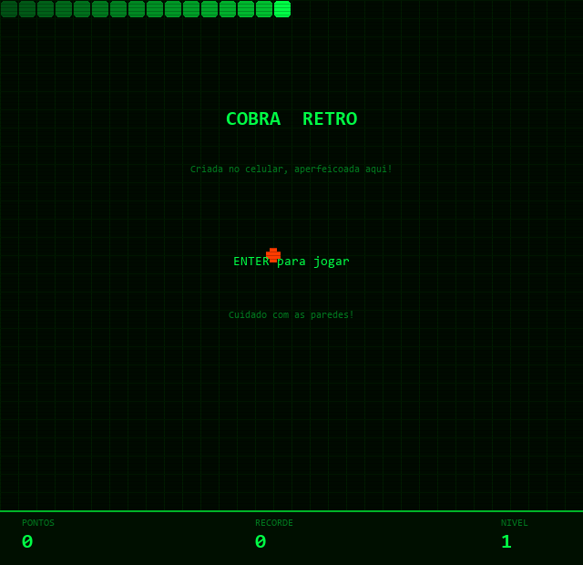

# Cobra Retrô

Jogo da cobra com visual estilo terminal verde fósforo — scanlines, grade escura e partículas. Nasceu no notepad do celular, ganhou forma aqui.



## Funcionalidades

- **Tema retrô green phosphor** — fundo escuro, grade, efeito de scanlines CRT
- **Cobra gradiente** com olhos animados por direção
- **Comida em cruz** no estilo pixel-art
- **Partículas** ao comer e ao morrer
- **Flash verde** na morte
- **Progressão de velocidade** por nível
- **Highscore** salvo em `highscore.json`
- **Painel inferior** com pontos, recorde e nível
- **Sons 8-bit** gerados por código — música chiptune, blip, nível e morte

## Controles

| Tecla | Ação |
|-------|------|
| `↑ ↓ ← →` | Mover a cobra |
| `W A S D` | Mover (alternativo) |
| `Enter` | Iniciar / reiniciar |
| `P` | Pausar / retomar |
| `Esc` | Sair |

## Requisitos

```bash
pip install pygame
```

## Como jogar

```bash
python jogo.py
```

## Desenvolvido por

**Leandro Oliveira Moraes**
